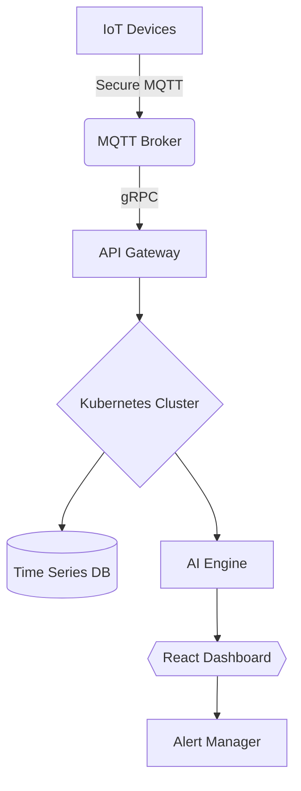

# **GuardCore 🔒**  
**Secure IoT Communication Platform**  
*An Open-Source Guardian for Your Connected Devices*

---

## 🌐 **The Challenge**  
In today's hyper-connected world, IoT devices often transmit sensitive data (e.g., medical metrics, industrial sensors) over vulnerable networks. A single unencrypted MQTT message or a compromised device can expose entire systems to **data breaches**, **spoofing attacks**, or **ransomware**. Traditional solutions either lack end-to-end security or lock users into expensive proprietary ecosystems.

---

## 🛡️ **GuardCore's Solution**  
GuardCore acts as a **security forcefield** for IoT ecosystems, combining **military-grade encryption** (AES-256 + TLS 1.3) with open-source flexibility. Unlike closed systems, it enables developers to implement **zero-trust security** across any device-to-cloud workflow while maintaining full control.

---

## 💡 **Example: Smart Home Security**

### **Problem:**  
A Wi-Fi door lock sends status updates via plaintext MQTT, making it vulnerable to packet sniffing.

### **GuardCore Fix:**  
```python
# Before (Insecure)
client.publish("home/lock", "UNLOCKED")  

# After (GuardCore Secured)
encrypted = aes.encrypt("UNLOCKED", key=SHARED_SECRET)  
client.publish("home/lock", encrypted, qos=2, tls=True)
```

With GuardCore, the lock’s data becomes unreadable to interceptors while allowing legitimate apps to decrypt it via GuardCore’s verified key exchange.

---

## ✨ **Features**
- **End-to-End Encryption**: Military-grade AES-256 encryption and TLS 1.3 for secure communications.
- **Open-Source Flexibility**: Fully customizable and extensible for any IoT use case.
- **Zero-Trust Security**: Implements device authentication and secure data exchange protocols.
- **Real-Time Monitoring**: Includes a dashboard for visualizing IoT device activity and alerts.

---

## 🚀 **Getting Started**

### Prerequisites:
1. Clone the repository:
   ```bash
   git clone https://github.com/Younes-Alaoui-Ismaili/GuardianCore.git
   cd GuardianCore
   ```
2. Install dependencies:
   ```bash
   pip install -r requirements.txt  # For backend
   npm install                      # For frontend
   ```

### Quick Start:
1. Start the backend services:
   ```bash
   docker-compose up --build
   ```
2. Access the dashboard:
   Open your browser and navigate to `http://localhost:3000`.

---

## 📊 **Architecture**


---

## 🤝 **Contributing**
We welcome contributions! To contribute:
1. Fork the repository.
2. Create a new branch (`git checkout -b feature/AmazingFeature`).
3. Commit your changes (`git commit -m 'Add some AmazingFeature'`).
4. Push to the branch (`git push origin feature/AmazingFeature`).
5. Open a pull request.

---

## 📜 **License**
This project is licensed under the MIT License - see the [LICENSE](LICENSE) file for details.
