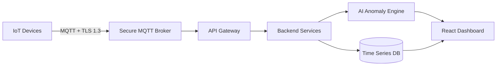

# GuardianCore

> Prototype 2025, exploration zero-trust pour communication IoT (AES-256, TLS 1.3).


---

## Pourquoi ce repo

Exploration de patterns de sécurité IoT zero-trust qui ont nourri la conception du sous-système privacy d'Aura, mon compagnon vocal IA edge-first pour personnes isolées (Solutions Robaian, Montréal).

**Statut** : prototype d'exploration, non maintenu depuis janvier 2025.

**Pertinence Aura** : les patterns de chiffrement bout-en-bout (AES-256), d'authentification zero-trust et de canal MQTT chiffré ont été directement réutilisés dans le sous-système privacy d'Aura (SQLCipher AES-256, PKI propriétaire, audit trail HMAC chaîné, conformité Loi 25 du Québec).

---

## Ce que démontre ce projet

- Chiffrement de bout en bout (AES-256 + TLS 1.3) sur MQTT.
- Authentification zero-trust pour devices IoT.
- Tableau de bord temps réel pour observabilité d'écosystème IoT.
- Architecture modulaire (broker MQTT sécurisé + API gateway + time series DB + UI React).

## Architecture


```mermaid
flowchart LR
    Devices[IoT Devices] -->|MQTT + TLS 1.3| Broker[Secure MQTT Broker]
    Broker --> Gateway[API Gateway]
    Gateway --> Backend[Backend Services]
    Backend --> TSDB[(Time Series DB)]
    Backend --> AI[AI Anomaly Engine]
    AI --> Dashboard[React Dashboard]
    TSDB --> Dashboard
```

## Stack

- **Backend** : Python (Flask + paho-mqtt).
- **Frontend** : React + TypeScript.
- **Sécurité** : AES-256 + TLS 1.3 + zero-trust auth.
- **Stockage** : Time Series DB pour historique.

## Démarrer

```bash
git clone https://github.com/Younes-Alaoui-Ismaili/GuardianCore.git
cd GuardianCore
pip install -r requirements.txt
npm install
python app.py
```

Dashboard : `http://localhost:3000`.

---

## À propos

Younes Alaoui Ismaili, fondateur de Solutions Robaian inc.
Site web (à venir) : [robaian.com](https://robaian.com)
Contact : info@robaian.com

## Licence

MIT.
